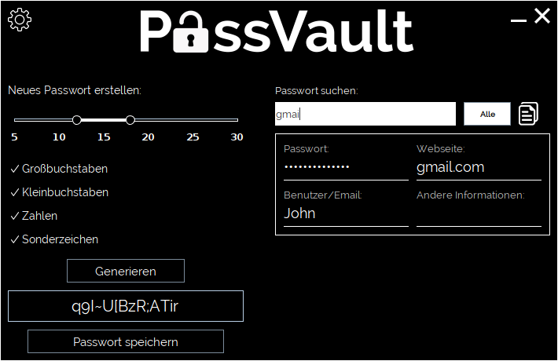
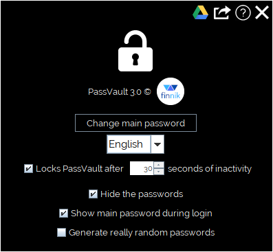

The PassVault program implements an application that saves passwords encrypted with a main password. 
It also generates new passwords with a given length and given parameters.

# Table of contents

- [Installation & Quick Start](#installation-&-quick-start)
- [Generate a new password](#generate-a-new-password)
- [Manage your passwords](#manage-your-passwords)
- [Settings](#settings)
- [API](#api)
- [Credits](#credits)

# Installation & Quick Start
1. Make sure you have [java](https://www.java.com/download/) installed on your computer
2. [Download](https://t1p.de/passvault) the latest PassVault_Installer.exe file or a .jar file in the other versions folder
3. Installer: execute the .exe file and follow the instructions (Attention: Probably your anti-virus program will warn you against this file because it isn´t signed, you can ignore this warning for sure)
4. .jar file: Execute the file (Note: application files will be created in the execution directory)
5. After installing you should be able to see the main window of the PassVault application:

This window is mainly divided into two parts:
- In the left part of the window you can [generate new passwords](#generate-a-new-password) by choosing the variety of characters and the length
- In the right part you can [manage your passwords](#manage-your-passwords) by searching, deleting, editing and copying to the clipboard

# Generate a new password

In the left part of the PassVault window you can generate a random and safe password. 
You can choose the length of it and which characters the new password should contain. 
The “Generate” button (who would have thought it) generates the password and displays it in the area below. 
By clicking on the “Save password” button, you open a new window where you can hand in some information about your password. 
A generated password will automatically be filled into the password field:

The button “Save and copy password” saves the new password with its information and copies it to your clipboard. 

When you save a password for the first time, you´ll have to enter a main password with that all of your passwords will be encrypted (you can change it later, if you want to).

# Manage your passwords
In the right part of the PassVault window you can manage your passwords. 
By entering some information in the “Search password” field, the table below will display all matching passwords. 
And if you want to fill a password to a form fast, you can select an entry and click the copy button right above the table to copy it to your clipboard. 
If you are searching a password with the field and the table displays just one entry, you can also press enter to copy it directly to the clipboard.

The “All” button toggles between the searching mode and the display all mode. 
In searching mode, the table show the passwords matching to your input and in display all mode the table shows all your saved passwords.

You can also edit or delete the passwords that are displayed in the table. 
To edit a password, double-click on the information of the password that you want to edit and type in the new information. 
To save the edited password just press enter. To delete a password, select any information of the password and press “delete”.
You’ll have to confirm the deletion.

To get a better view of your passwords you can sort them alphabetically by a parameter. 
Just click on the right of the head column of the sorting parameter and click once again to sort them in the opposite direction.

# Settings
By clicking on the i(nformation) icon in the left top corner, you open the settings frame:

## Changing your main password
You can easily change your main password by hitting the button. 
First, you’ll have to enter your current main password and after that you can change it by inputting the new one two times.

## Changing the language
The box below the mentioned button allows you to change the display language of PassVault. 
At the moment, there are three available language packs: English, German and French.

## Export your current passwords
PassVault also allows you to make a backup of your current saved passwords: 

Simply click the first icon in the toolbar above the logo and select the directory on your computer to export all your passwords encrypted.

## Import a backup
To import passwords from a backup file you have two options: 

First, you can just drag it to the main frame. 

The second option is pressing shift and do a right-click at the same time somewhere near the PassVault logo. 
In the opening dialog you can select the backup file.

After selecting the backup file, you’ll have to enter the main password with that the file was encrypted (your main password at exporting). 
If the password is correct, all passwords that are not already saved, will be added to your passwords.

## Inactivity
From PassVault 2.0, there's a feature that allows you to lock PassVault after a certain time of inactivity.

With the tick box you can enable/disable this feature.
In the textfield you can enter the time after that PassVault will be locked in seconds. (Valid values between 10 and 3600)

## Get help
The help icon will lead you to this GitHub repository. 
If you need more help, you can contact us: [de.finnik@gmx.net](mailto:de.finnik@gmx.net)

# API
From PassVault 2.2, other developers have the possibility of including PassVault to their projects.
There's an API that allows other programs to get access to the saved passwords of the user.

The API has two features:
- Adding a password to the password list of the user
- Getting passwords matching to a keyword

The user has to enter his main password in both cases before something happens.

If you want to include PassVault via the API to one of your projects, you can simply execute the PassVault program e.g. via the command line
and append help as an argument. You will get a list of all available commands and via appending help to a command, you'll learn how to use them.

The default installation folder of PassVault is C:\\Users\\%username%\\AppData\\Local\\Programs\\PassVault

Example for adding a password to the users' password list:

# Credits
Raleway font:
- Matt McInerney ([matt@pixelspread.com](mailto:matt@pixelspread.com))
- Pablo Impallari ([www.impallari.com](www.impallari.com) | [impallari@gmail.com](mailto:impallari@gmail.com))
- Rodrigo Fuenzalida ([www.rfuenzalida.com](www.rfuenzalida.com) | [hello@rfuenzalida.com](mailto:hello@rfuenzalida.com))

QOS.ch [Logback](http://logback.qos.ch) framework

Google Inc [Gson](https://github.com/google/gson) API

Thanks to B. for designing the finnik logo

